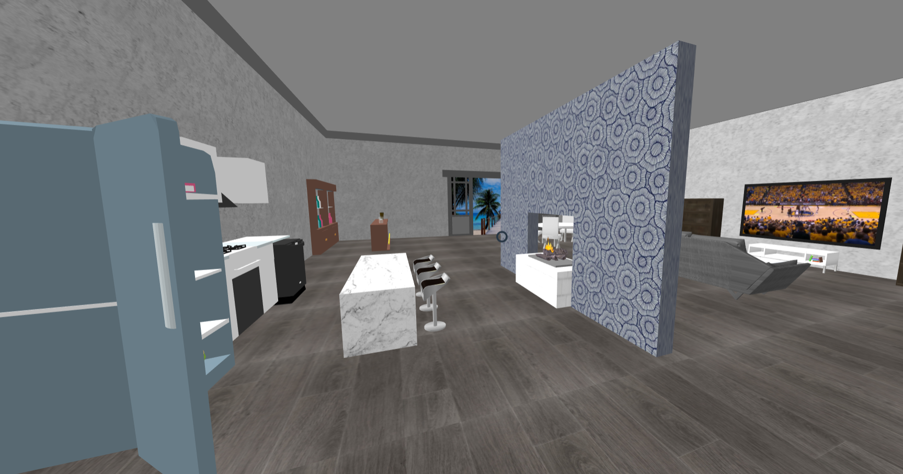
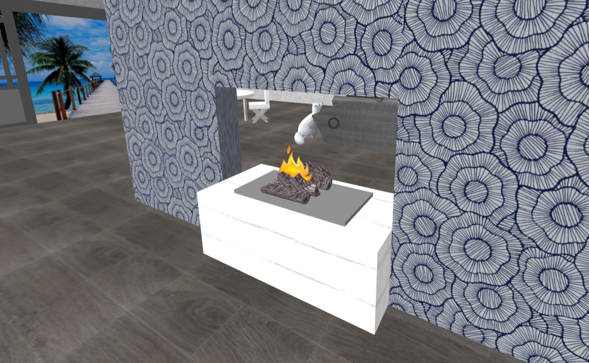
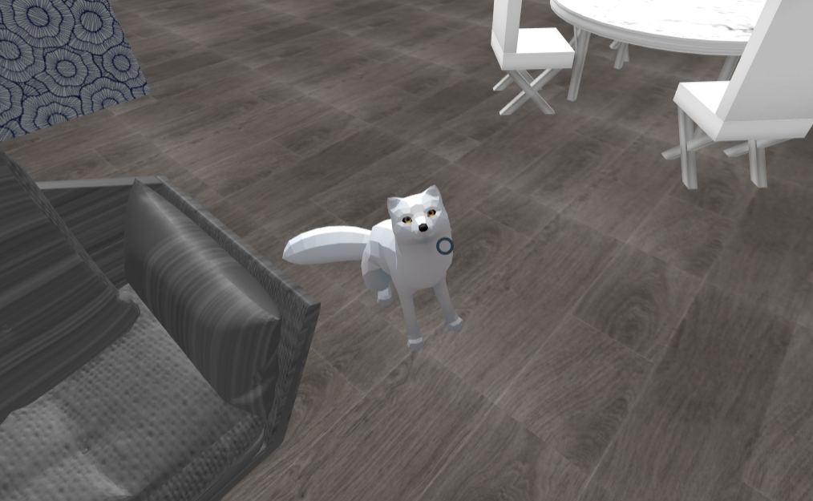
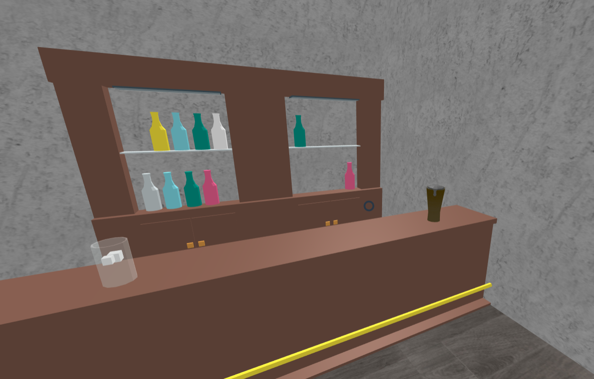
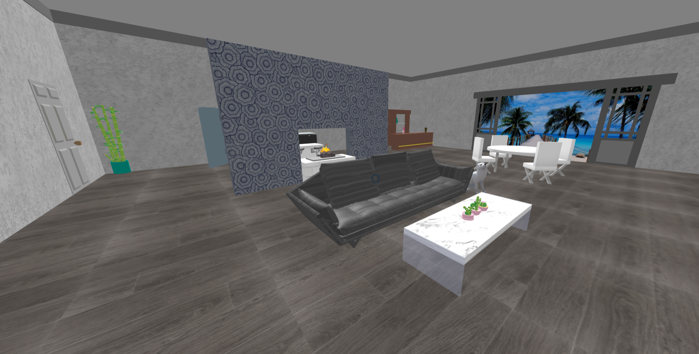
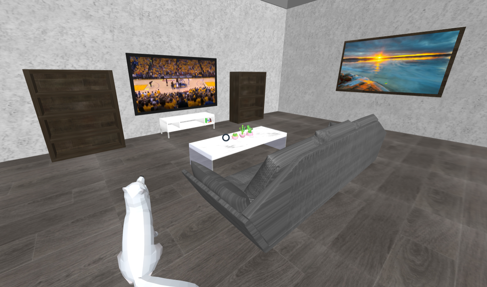
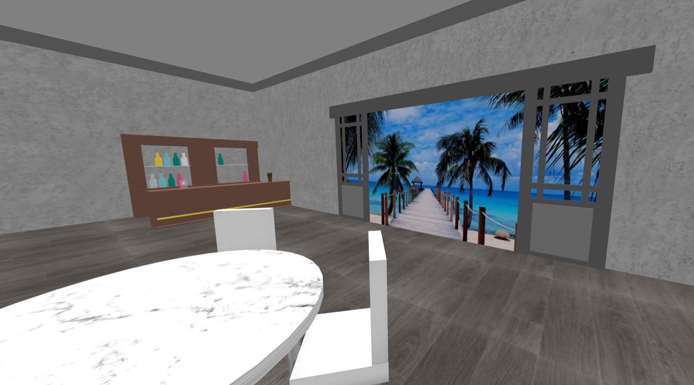
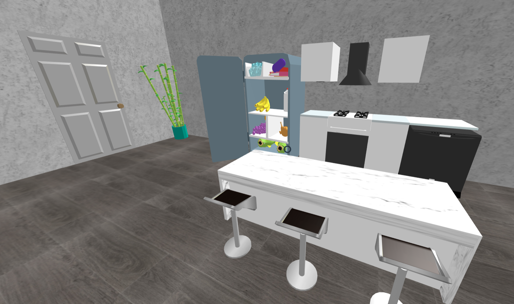
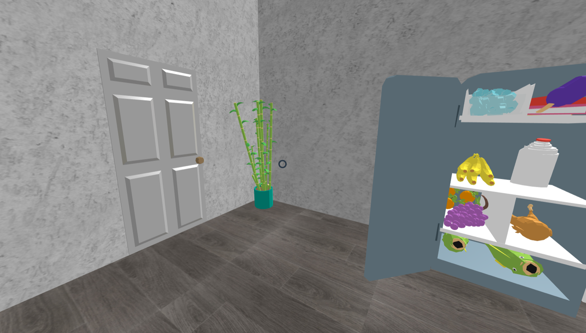

# Virtual Reality Project 1
### Dream Home
Focuses on creating a human scale scene experienced from the 'inside out'. This scene can also be viewed with Google Cardboard on Android devices for full functionality.

** Click the image below to open a video demo **  

 
The web version can be found [here](https://mktaylor5.github.io/) 

### Notes
*Audio clips are not compatible with iOS devices in Google Cardboard.*

### User Interactions (3 total)
- The fire in the fireplace moves in a loop indefinitely to simulate a fire's movement. The fireplace can also be clicked on to play a fire crackling sound clip.

- The fox sitting next to the couch can also be interacted with. When clicked, an audio clip of a fox bark will play.

- There is also a dynamic model on the bar counter in the corner. Clicking on the drink will slide it across the counter top.

### Visuals

### Models (23 total, 9 custom, 12 imported)
- [Bar (obj model)](https://poly.google.com/view/b4_X-wRqmyP)
- [Bar Stools](https://poly.google.com/view/63U8J3bGSaO)
- [Books](https://poly.google.com/view/3ZqFRk2aK65)
- Bookshelves - two, wooden (custom model)
- Coffee Table - marble (custom model)
- Dining Table (custom model)
- Dining Chairs(4) (custom models)
- [Dishwasher](https://poly.google.com/view/6GFFoaRr-mW)
- [Drink](https://poly.google.com/view/fxdbI0U4gLt)
- Entertainment Center - White (custom model)
- Glass Door with beach view (custom model)
- [Fire Sound](https://freesound.org/people/acclivity/sounds/29939/)
- [Firewood](https://www.cgtrader.com/free-3d-models/architectural/other/fire-wood-d280831d198a659e8d22173c8efdaafc)
- [Fox](https://poly.google.com/view/dK08uQ8-Zm9)
- [Fox Sound](https://averageoutdoorsman.com/wild-game-downloads/fox/)
- [Fridge](https://poly.google.com/view/7ojotRZrabO)
- [Kitchen](https://poly.google.com/view/ekYAOSqE8fI)
- Kitchen counter (extended 3D-model with more counter space)
- Painting
- [Potted Plant](https://poly.google.com/view/92c_Fqfhz5z)
- [Robocactus](https://poly.google.com/view/biz9e5l6NmV)
- Room Divider with wallpaper (custom model)
- Television (custom model)
- [White Door](https://poly.google.com/view/dRvd7q2nO-6)

### Other Sources
- [Art](https://wallpaperscraft.com/image/ocean_sky_light_82603_2560x1600.jpg)
- [Basketball Game (screenshot from video)](https://www.youtube.com/watch?v=Mxv5h-RZWVs)
